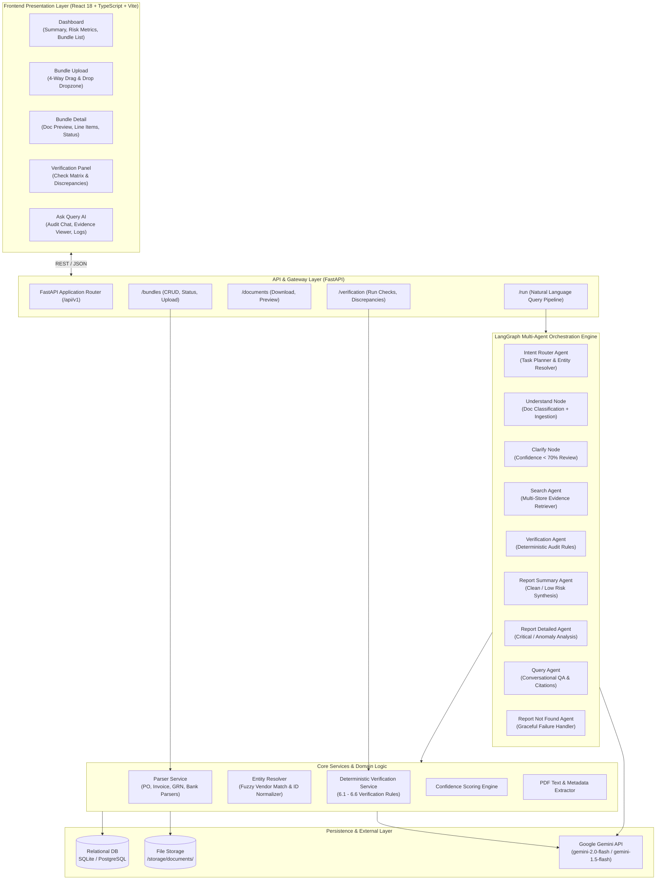
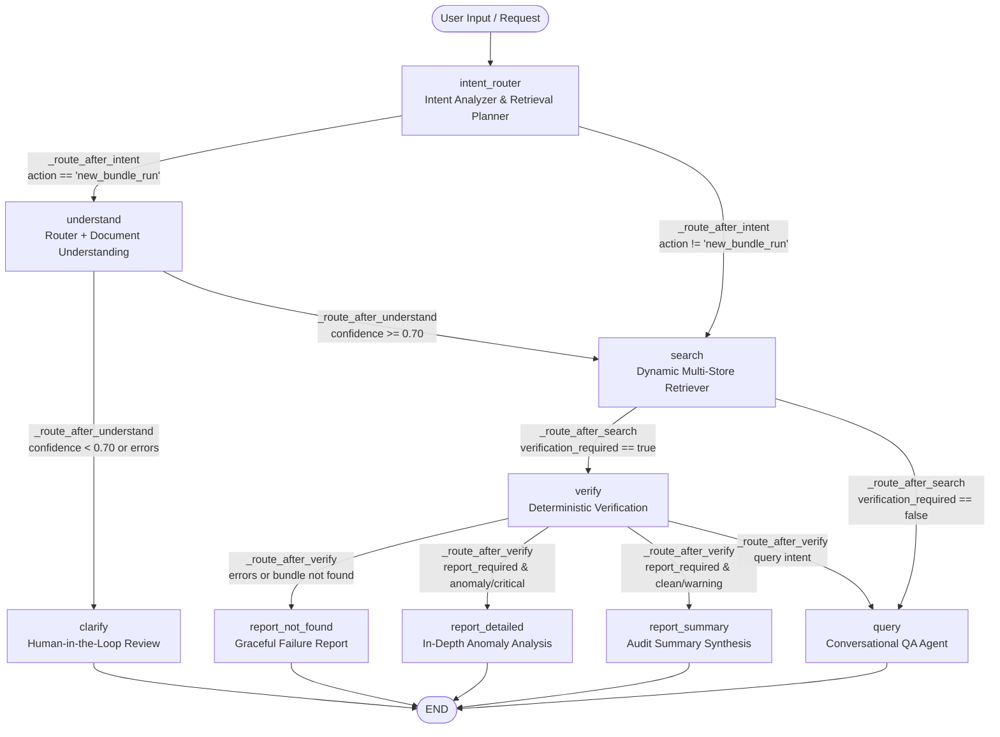
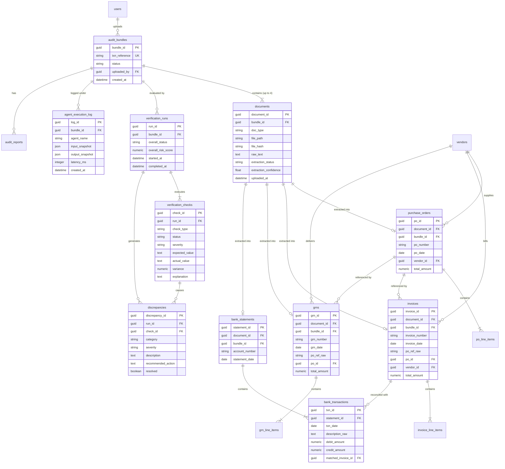
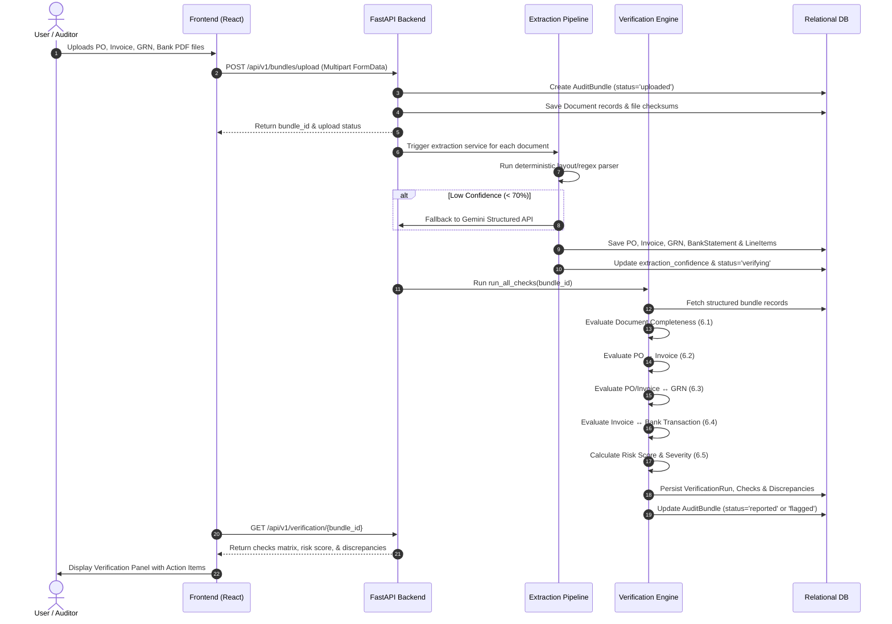
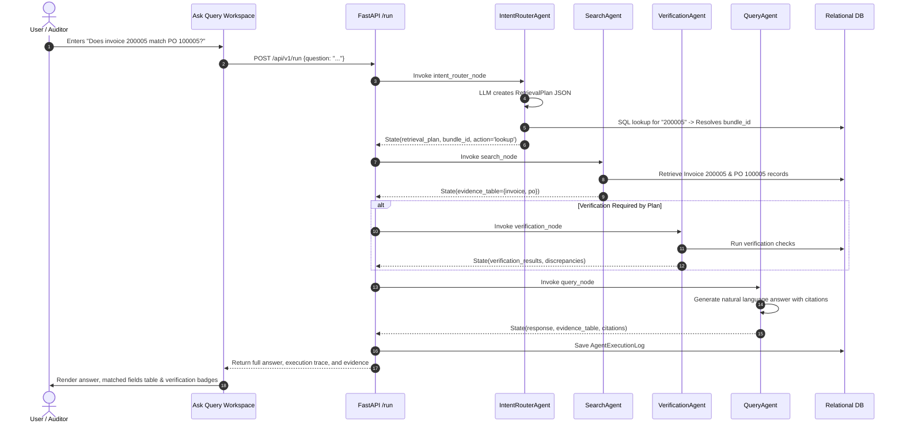

# Multi-Agent Audit Evidence Assistant — System Architecture

An enterprise-grade, multi-agent AI platform for automated financial auditing, 4-way document reconciliation (Purchase Orders, Invoices, Goods Received Notes, Bank Statements), discrepancy detection, and natural language audit intelligence.

---

## 1. System Overview & Architectural Principles

The **Multi-Agent Audit Evidence Assistant** bridges deterministic financial compliance rules with generative AI reasoning. It processes multimodal corporate audit bundles, extracts structured financial entities, performs mathematical 4-way reconciliation across all transaction lifecycle documents, flags anomalies with calculated risk scores, and answers auditor queries with exact citations.

```
       ┌─────────────────────────────────────────────────────────────┐
       │                   AUDIT WORKFLOW OVERVIEW                   │
       └─────────────────────────────────────────────────────────────┘

       [ Purchase Order ] ───┐
       [ Invoice        ] ───┼──► [ Ingestion & Extraction ] ──► [ Deterministic 4-Way Match ]
       [ GRN            ] ───┤          (Parsers + LLM)               (Zero LLM Hallucination)
       [ Bank Statement ] ───┘                                              │
                                                                            ▼
                                                                 [ Discrepancy & Risk Report ]
                                                                            │
   [ Natural Language Queries ] ──► [ LangGraph Multi-Agent Flow ] ◄────────┘
```

### Core Architectural Principles

1. **Deterministic Verification Integrity**: Financial computations, tolerance checks, line item matching, and discrepancy evaluations are calculated strictly in deterministic Python code. Large Language Models (LLMs) are **never** used to compute arithmetic or decide financial verdicts.
2. **Hybrid Ingestion Pipeline**: Deterministic regex and layout-aware PDF parsers extract document fields with high throughput. Google Gemini LLM acts as an adaptive fallback when document formats deviate or OCR confidence falls below threshold.
3. **Stateful Multi-Agent Orchestration**: Agent execution follows an explicit, cyclic directed graph built with [LangGraph](https://github.com/langchain-ai/langgraph), sharing a typed `BundleState`.
4. **Traceable Audit Log & Observability**: Every agent execution, input snapshot, output payload, latency, and rule evaluation is persisted to the database for regulatory compliance and audit trails.
5. **Cross-Platform Database Layer**: Platform-independent GUIDs enable seamless switching between local SQLite development and production PostgreSQL instances.

---

## 2. High-Level Architecture

The system is structured as a decoupled, layered micro-architecture:



---

## 3. Detailed Component Architecture

### 3.1. Frontend Architecture (`frontend/src`)

The frontend is a single-page application (SPA) built with **React 18**, **TypeScript**, and **Vite**, offering responsive audit management views:

```
frontend/src/
├── api/                  # Axios/Fetch API client abstractions
│   └── client.ts         # Base HTTP client with baseURL & error handlers
├── components/           # Reusable UI component library
│   ├── DocumentPreviewCard.tsx  # Document summary & preview modal trigger
│   ├── Navbar.tsx               # Navigation header & system status
│   ├── UploadDropzone.tsx       # 4-slot file upload (PO, Inv, GRN, Bank)
│   └── VerificationPanel.tsx    # Checks matrix, severity badges, discrepancy list
├── pages/                # Primary application views
│   ├── Dashboard.tsx            # High-level KPIs, bundle status overview
│   ├── BundleUpload.tsx         # Multi-document bundle upload workflow
│   ├── BundleDetail.tsx         # Deep-dive bundle inspection & document tabs
│   └── AskQuery.tsx             # Interactive conversational audit assistant
├── types/                # TypeScript interface & schema definitions
│   └── index.ts                 # Bundle, Document, Verification, & Query types
├── App.tsx               # Client router configuration & global layout
├── main.tsx              # React DOM entry point
└── index.css             # Design tokens, CSS variables, glassmorphism styling
```

#### Key Frontend Modules

* **`Dashboard.tsx`**: Aggregates total audit bundles, processing statuses (`uploaded`, `extracting`, `verifying`, `reported`, `failed`), flagged discrepancies, and overall risk levels.
* **`BundleUpload.tsx` & `UploadDropzone.tsx`**: Provides coordinated drag-and-drop slots for the 4 core audit documents, calculating client-side checksums and triggering multi-part upload.
* **`BundleDetail.tsx`**: Displays extracted structured entities across tabs (Purchase Order, Invoice, GRN, Bank Statement) alongside extraction confidence metrics.
* **`VerificationPanel.tsx`**: Renders deterministic verification checks grouped by severity (`critical`, `high`, `medium`, `low`, `pass`) with variance calculations and resolution actions.
* **`AskQuery.tsx`**: Chat workspace allowing auditors to ask natural language questions (e.g., *"Does invoice 200005 match PO 100005?"*, *"Show bank payment for vendor Apex"*), displaying agent execution timelines, retrieval plans, and tabular evidence.

---

### 3.2. Backend API Layer (`backend/app/api`)

The backend is built with **FastAPI** using asynchronous routing and Pydantic validation schemas.

| Route Prefix | Module | Purpose |
| :--- | :--- | :--- |
| `/api/v1/bundles` | `bundles.py` | Bundle creation, metadata retrieval, status polling, and bundle deletion. |
| `/api/v1/documents` | `documents.py` | Document upload, text extraction triggers, raw file download, and preview. |
| `/api/v1/verification` | `verification.py` | Deterministic verification trigger, verification results, discrepancies query. |
| `/api/v1/run` | `run.py` | LangGraph multi-agent execution pipeline for conversational audit queries. |

---

### 3.3. Multi-Agent Orchestration Graph (`backend/app/agents`)

The agent workflow is modeled as a compiled **LangGraph `StateGraph`** with typed state propagation via `BundleState`.



#### Shared Graph State (`BundleState`)

The state dictionary is passed immutably across nodes:

```python
class BundleState(TypedDict, total=False):
    # Context & Identifiers
    bundle_id: Optional[str]
    question: Optional[str]
    action: Optional[str]                 # 'new_bundle_run' | 'status_query' | 'lookup' | etc.
    
    # Ingestion & Understanding
    raw_documents: List[Dict[str, Any]]
    doc_types: Dict[str, str]             # {doc_id: 'invoice' | 'purchase_order' | ...}
    extracted: Dict[str, Any]             # Structured fields per document type
    extraction_confidence: float          # Aggregate confidence (0.0 to 1.0)
    
    # Retrieval & Planning
    retrieval_plan: Optional[Dict[str, Any]] # Intent, required docs, verification flag
    evidence_table: Dict[str, Any]        # Retrieved entities & records
    
    # Verification & Reporting
    verification_results: List[Dict[str, Any]]
    discrepancies: List[Dict[str, Any]]
    verdict: Optional[str]                # 'clean' | 'anomaly' | 'needs_review' | 'error'
    severity: Optional[str]               # 'low' | 'medium' | 'high' | 'critical'
    risk_score: float                     # Weighted composite risk (0 - 100)
    report: Optional[Dict[str, Any]]
    response: Optional[str]               # Final natural language output
    citations: List[Dict[str, Any]]
    errors: List[str]
```

#### Agent Roles and Execution Logic

1. **`intent_router_agent`**:
   * **Task 1 (Retrieval Planning)**: Calls Gemini with strict JSON schema to generate a `RetrievalPlan` (`intent`, `bundle_reference`, `required_documents`, `required_fields`, `verification_required`, `report_required`).
   * **Task 2 (Entity Resolution)**: Executes deterministic SQL regex matching against `PurchaseOrder`, `Invoice`, `GRN`, `BankTransaction`, and `Vendor` tables to resolve raw user references (e.g. `"PO 100005"`, `"Invoice 200005"`) into a canonical `bundle_id`.
2. **`router_agent` & `document_agent` (`understand_node`)**:
   * Classifies uploaded PDF documents into `purchase_order`, `invoice`, `grn`, or `bank_statement`.
   * Triggers deterministic parsers with automatic fallback to LLM structured extraction.
3. **`clarify_node`**:
   * Halts automated progression if document extraction confidence drops below `0.70`, marking bundle status as `needs_review` for human auditor intervention.
4. **`search_agent`**:
   * Dynamically loads required evidence from the database into `evidence_table` based on the `retrieval_plan`.
5. **`verification_agent`**:
   * Executes the deterministic verification service, evaluating 4-way matching rules, variances, tax checks, and populating `verification_results` and `discrepancies`.
6. **`report_summary_agent` / `report_detailed_agent`**:
   * Formats structured verification findings into markdown and JSON audit reports. Anomaly/critical findings trigger root-cause analysis and auditor remediation steps.
7. **`query_agent`**:
   * Synthesizes conversational answers to ad-hoc auditor inquiries, appending evidence tables, exact document numbers, and source citations.
8. **`report_not_found_agent`**:
   * Returns helpful, structured diagnostic messages when an entity or document reference cannot be resolved in the database.

---

### 3.4. Document Parsing & Extraction Subsystem (`backend/app/services/parsers`)

```
backend/app/services/
├── parsers/
│   ├── base_parser.py       # Abstract Base Parser interface
│   ├── invoice_parser.py    # Invoice regex, layout & tabular parser
│   ├── po_parser.py         # Purchase Order parser
│   ├── grn_parser.py        # Goods Received Note parser
│   ├── bank_parser.py       # Bank statement & transaction line parser
│   └── text_utils.py        # String sanitization & date normalizers
├── extraction_service.py    # Orchestrates parsers with LLM fallback
├── entity_resolver.py       # Normalizes vendor names & resolves cross-refs
├── confidence.py            # Computes field-level & document-level confidence
└── pdf_service.py           # PyPDF2 / pdfplumber extraction wrapper
```

```mermaid
flowchart TD
    PDF[Raw PDF Document] --> PDFSvc[PDF Service Extraction]
    PDFSvc --> RawText[Extracted Raw Text & Layout]
    RawText --> DetParser{Deterministic Parser\nInvoice / PO / GRN / Bank}
    
    DetParser -->|Success & Confidence >= 0.70| StructData[Structured Schema Object]
    DetParser -->|Format Variance / Low Confidence| LLMFallback[Google Gemini Structured Extraction\n(Pydantic Schema Constrained)]
    LLMFallback --> StructData
    
    StructData --> EntityRes[Entity Resolver\nVendor Normalization & Reference Linking]
    EntityRes --> DBWrite[(Write to Domain Tables\n& Documents Table)]
```

---

### 3.5. Deterministic Verification Rules Engine (`backend/app/services/verification_service.py`)

The verification engine enforces 4-way audit reconciliation rules. **All calculations use Python `Decimal` arithmetic with round-half-up quantization.**

| Rule Category | Check Identifier | Logic & Invariants | Pass / Fail Condition |
| :--- | :--- | :--- | :--- |
| **6.1 Document Completeness** | `doc_completeness_<type>` | Verifies all 4 documents exist in bundle. | Missing document = `FAIL` (High/Critical) |
| **6.2 PO ↔ Invoice** | `po_invoice_ref_match` | Checks normalized PO number matches Invoice PO reference. | Mismatch = `FAIL` (Critical) |
| | `po_invoice_vendor_match` | Fuzzy token sort ratio on vendor names. | $\ge 90\%$: `PASS`, $70-89\%$: `WARNING`, $< 70\%$: `FAIL` |
| | `po_invoice_amount_match` | Total amount comparison within tolerance $\max(\$1.00, 0.1\% \times PO)$. | $|PO - Inv| \le \text{Tol}$: `PASS` |
| | `po_invoice_tax_calc` | Verifies Subtotal $\times$ Tax Rate = Tax Amount. | Variance $\le \$0.05$: `PASS` |
| | `po_invoice_date_seq` | Verifies $PO Date \le Invoice Date$. | $PO > Inv$: `FAIL` (High) |
| **6.3 PO / Inv ↔ GRN** | `po_grn_ref_match` | Verifies GRN references correct PO / Invoice. | Mismatch = `FAIL` (Critical) |
| | `grn_item_qty_match` | Compares line item quantity ordered vs quantity received. | $Qty_{recv} > Qty_{ord}$: `FAIL` (Over-delivery)<br>$Qty_{recv} < Qty_{ord}$: `WARNING` (Shortfall) |
| | `grn_received_condition` | Checks delivery condition notes (e.g. damaged goods). | Damaged/Defective = `WARNING` |
| **6.4 Invoice ↔ Bank** | `bank_payment_match` | Matches bank debit transaction to invoice number & amount. | No matching debit = `FAIL` (Unpaid/Missing) |
| | `bank_payment_amount` | Compares debit amount to invoice total. | Variance $> \$1.00$: `FAIL` (Under/Over-payment) |
| | `bank_payment_date_seq` | Verifies $Payment Date \ge Invoice Date$. | Payment prior to invoice = `WARNING` |
| **6.5 Composite Risk** | `overall_risk_score` | Weighted sum: Critical (40), High (20), Medium (10), Low (5). | $Score = \min(100, \sum Weights)$ |

---

## 4. Database & Entity Relationship Model

The database schema is defined using **SQLAlchemy ORM** with cross-platform `GUID` types.



---

## 5. End-to-End Execution Workflows

### 5.1. Bundle Ingestion & Automated Verification Flow



### 5.2. Conversational Audit Query Flow (`/api/v1/run`)



---

## 6. Observability, Security & Compliance

### 6.1. Audit Logging & Compliance Traceability
* **Immutable Run Logs (`agent_execution_log`)**: Every node execution in LangGraph records input/output snapshots, latency in milliseconds, model parameters, and errors.
* **Deterministic Verification Versioning**: All verification runs track `rules_version` (`1.0`) ensuring repeatable audits.
* **Document Integrity**: All uploaded documents store SHA-256 file hashes (`file_hash`) to detect tampering or duplicate submissions.

### 6.2. Error Handling & Graceful Degradation
* **Pydantic Validation**: All LLM outputs are validated against strict Pydantic schemas. If JSON schema parsing fails, fallback regular expression extractors or retry nodes are triggered.
* **Database Fallback Resolution**: When raw text entity lookups fail, the `IntentRouterAgent` falls back to fuzzy token matching across active vendor registries and PO numbers before gracefully invoking `ReportNotFoundAgent`.
* **Zero Hallucination Guarantee**: In financial reconciliation tables, exact numbers are loaded directly from database entities rather than generated by LLM reasoning.

---

## 7. Project Directory & File Reference

```
MultiAgentEvidencesystem/
├── ARCHITECTURE.md                             # System architecture specification (this document)
├── Audit_Evidence_Assistant_Implementation_Guide.md # Technical implementation details & rules
├── README.md                                   # Project overview, installation, and usage instructions
├── docker-compose.yml                          # Container orchestration definition
│
├── backend/                                    # FastAPI & LangGraph Backend Service
│   ├── Dockerfile                              # Backend container image build
│   ├── requirements.txt                        # Python dependencies
│   ├── alembic/                                # Database migration scripts
│   ├── alembic.ini                             # Alembic configuration
│   └── app/
│       ├── main.py                             # FastAPI application entry point & CORS
│       ├── agents/                             # LangGraph Multi-Agent implementation
│       │   ├── graph.py                        # StateGraph workflow definition & routing logic
│       │   ├── state.py                        # BundleState definition
│       │   ├── intent_router_agent.py          # Intent analysis & SQL entity resolution
│       │   ├── router_agent.py                 # Document classification agent
│       │   ├── document_agent.py               # Document understanding & ingestion node
│       │   ├── search_agent.py                 # Evidence retriever agent
│       │   ├── verification_agent.py           # Audit verification node
│       │   ├── report_agent.py                 # Summary & detailed reporting nodes
│       │   └── query_agent.py                  # Conversational QA agent
│       ├── api/                                # REST API routers
│       │   └── v1/
│       │       ├── router.py                   # Central v1 APIRouter
│       │       ├── bundles.py                  # Bundle management endpoints
│       │       ├── documents.py                # Document upload & preview endpoints
│       │       ├── verification.py             # Verification execution endpoints
│       │       └── run.py                      # Multi-agent query runner endpoint
│       ├── core/                               # Core application utilities
│       │   ├── config.py                       # Pydantic BaseSettings (.env loading)
│       │   ├── logging.py                      # Loguru / Standard logging configuration
│       │   └── gemini_client.py                # Google Gemini API client wrapper
│       ├── db/                                 # Database connections
│       │   ├── base.py                         # SQLAlchemy declarative base
│       │   └── session.py                      # SessionLocal factory & engine initialization
│       ├── models/                             # SQLAlchemy ORM Models
│       │   └── models.py                       # All relational tables (Bundles, Docs, Checks, etc.)
│       ├── schemas/                            # Pydantic input/output schemas
│       │   ├── bundle_schemas.py               # Bundle request/response models
│       │   ├── extraction_schemas.py           # Extracted entity schemas (PO, Inv, GRN, Bank)
│       │   ├── router_schemas.py               # Classification schemas
│       │   └── verification_schemas.py         # Verification check response schemas
│       └── services/                           # Domain business logic
│           ├── verification_service.py         # Deterministic 4-way matching rules (6.1–6.6)
│           ├── extraction_service.py           # Hybrid parser coordinator
│           ├── entity_resolver.py              # Vendor fuzzy matcher & cross-referencing
│           ├── confidence.py                   # Confidence score calculation
│           ├── pdf_service.py                  # PDF layout & text extraction
│           └── parsers/                        # Deterministic document parsers
│               ├── base_parser.py              # Parser abstract base class
│               ├── invoice_parser.py           # Invoice extraction parser
│               ├── po_parser.py                # Purchase Order extraction parser
│               ├── grn_parser.py               # Goods Received Note extraction parser
│               ├── bank_parser.py              # Bank statement extraction parser
│               └── text_utils.py               # Text cleaning utilities
│
└── frontend/                                   # React + Vite Frontend Application
    ├── package.json                            # Frontend npm dependencies & scripts
    ├── tsconfig.json                           # TypeScript configuration
    ├── vite.config.ts                          # Vite build tool configuration
    ├── index.html                              # HTML entry template
    └── src/
        ├── main.tsx                            # React root mount
        ├── App.tsx                             # App routes & navigation layout
        ├── index.css                           # Global design system & theme styling
        ├── api/                                # HTTP API service layer
        │   └── client.ts                       # Axios API instance
        ├── components/                         # UI components
        │   ├── Navbar.tsx                      # Header navigation
        │   ├── UploadDropzone.tsx              # 4-way document upload dropzone
        │   ├── DocumentPreviewCard.tsx         # Document viewer card
        │   └── VerificationPanel.tsx           # Verification matrix & discrepancies
        ├── pages/                              # Application views
        │   ├── Dashboard.tsx                   # Audit system dashboard
        │   ├── BundleUpload.tsx                # Bundle creation page
        │   ├── BundleDetail.tsx                # Detailed bundle inspection page
        │   └── AskQuery.tsx                    # Multi-agent chat interface
        └── types/                              # TypeScript interfaces
            └── index.ts                        # Shared frontend types
```
