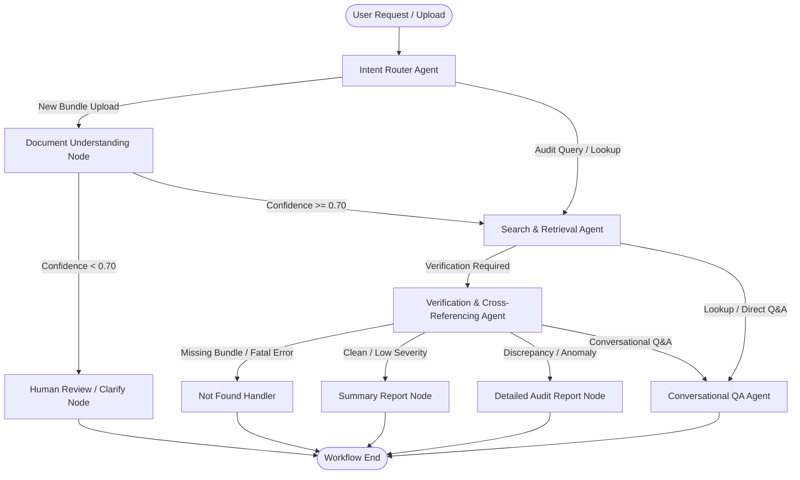

# 🛡️ Multi-Agent Audit Evidence System

> **An intelligent multi-agent AI system designed for automated audit evidence verification, cross-document reconciliation, and conversational financial audit assistance.**

[](https://fastapi.tiangolo.com)
[](https://reactjs.org/)
[](https://github.com/langchain-ai/langgraph)
[](https://www.typescriptlang.org/)
[](https://vitejs.dev/)
[](https://www.postgresql.org/)

---

## 📋 Table of Contents
1. [Overview](#-overview)
2. [Key Capabilities](#-key-capabilities)
3. [Multi-Agent Architecture](#-multi-agent-architecture)
4. [Audit Verification Rules](#-audit-verification-rules)
5. [Tech Stack](#-tech-stack)
6. [Project Structure](#-project-structure)
7. [Getting Started](#-getting-started)
   - [Prerequisites](#prerequisites)
   - [Backend Setup](#1-backend-setup)
   - [Frontend Setup](#2-frontend-setup)
   - [Docker Setup](#3-docker-compose-deployment)
8. [Configuration & Environment Variables](#-configuration--environment-variables)
9. [API Endpoints](#-api-endpoints)
10. [Usage & Example Queries](#-usage--example-queries)
11. [Audit Trail & Observability](#-audit-trail--observability)
12. [License](#-license)

---

## 🌟 Overview

The **Multi-Agent Audit Evidence System** automates the tedious and error-prone process of financial audit cross-referencing. By coordinating specialized LLM agents with deterministic mathematical checks, it cross-verifies purchase orders (POs), invoices, goods received notes (GRNs), and bank statements to detect discrepancies, overbilling, tax miscalculations, delivery shortages, and payment mismatches.

Auditors can upload entire document packages, run automated verification pipelines, explore visual audit trails, and converse naturally with an intelligent **Audit Query Agent** to get instant, grounded answers.

---

## 🚀 Key Capabilities

- **Automated 3-Way & 4-Way Matching**: Cross-examines Purchase Orders, Invoices, Delivery Receipts (GRN), and Bank Statements for amounts, dates, quantities, and vendor details.
- **Hybrid Multi-Agent Orchestration**: Built with **LangGraph** to coordinate intent parsing, document extraction, vector retrieval, cross-referencing, and report synthesis.
- **Deterministic Fast-Path Extraction**: High-speed, rule-based PDF parsing for tabular data with LLM fallback for non-standard formats.
- **Natural Language Audit Q&A**: Interactive search and query agent that understands natural audit questions (e.g. *"Show me all discrepancies in bundle 1"*, *"What is the invoice amount for PO 100005?"*).
- **Comprehensive Audit Trail**: Every agent step, latency, input snapshot, and output decision is logged to database records for transparency and compliance.
- **Automated Exception Handling & Human-in-the-Loop**: Flags low-confidence extractions (<70%) or missing evidence documents for manual auditor review.
- **Deterministic Audit Workpaper PDF Export**: Generates professional, presentation-ready audit workpapers (ReportLab) complete with cross-verification matrices, discrepancy logs, and SHA-256 evidence hashes.
- **Audit ROI & Business Impact Analytics**: Real-time portfolio metrics computed from database ground truth to quantify auditor time saved, exception rates, and value audited.
- **Modern Responsive UI**: Clean, responsive React/TypeScript interface with bundle managers, side-by-side document views, and execution telemetry graphs.

---

## 🤖 Multi-Agent Architecture

The system executes a compiled **LangGraph `StateGraph`** workflow where specialized agents handle dedicated responsibilities:



### Agent Roles & Responsibilities

| Agent / Node | Responsibility | Output / Artifacts |
|---|---|---|
| **Intent Router Agent** (`intent_router_agent.py`) | Classifies user intent (new bundle execution, field lookup, verification query, report regeneration) and extracts target entity identifiers. | `action`, `retrieval_plan`, `target_bundle_id` |
| **Document Understanding Agent** (`document_agent.py`, `router_agent.py`) | Extracts structured financial tables and header fields from PDF documents (POs, Invoices, GRNs, Bank Statements) with confidence scoring. | `extracted`, `extraction_confidence` |
| **Search & Retrieval Agent** (`search_agent.py`) | Performs hybrid retrieval combining SQL structured data with ChromaDB vector embeddings for semantic document search. | `evidence_table`, `retrieved_docs` |
| **Verification Agent** (`verification_agent.py`) | Applies deterministic rules, line-item arithmetic verification, and fuzzy string matching across all 4 document types. | `discrepancies`, `verdict`, `severity`, `confidence` |
| **Report Generation Agent** (`report_agent.py`) | Formats verification results into executive audit summaries, detailed exception breakdowns, or clarification requests. | `report`, `summary`, `status` |
| **Query Agent** (`query_agent.py`) | Generates grounded conversational answers with precise document citations and highlighted discrepancies. | `response`, `sources`, `discrepancy_count` |
| **State Checkpointer** (`checkpointer.py`) | Persists durable execution snapshots per bundle thread ID to PostgreSQL / SQLite (`PostgresSaver` / `SqliteSaver`). | `checkpoints`, `resumption state` |
| **Clarification Node** (`graph.py`) | Human-in-the-loop fallback when OCR/extraction confidence drops below safe threshold (70%). | Sets bundle status to `needs_review` |

---

## 🔍 Audit Verification Rules

The **Verification Agent** executes rigorous audit checks across multiple financial vectors:

1. **Arithmetic & Tax Verification**:
   - Line Item Totals: $\text{Quantity} \times \text{Unit Price} = \text{Subtotal}$
   - Tax Calculations: $\text{Subtotal} + \text{Tax (GST/VAT)} = \text{Total Amount}$
2. **3-Way Quantity & Price Matching**:
   - PO Ordered Qty vs GRN Received Qty vs Invoice Billed Qty (detects under-delivery and over-billing).
   - PO Unit Price vs Invoice Billed Unit Price.
3. **Entity & Vendor Consistency**:
   - RapidFuzz fuzzy matching for vendor and customer names across documents.
4. **Chronological & Date Logic**:
   - Order Date $\le$ Delivery Date $\le$ Invoice Date $\le$ Payment Date.
   - Detects fraudulent/anomalous back-dated invoices or payments preceding PO creation.
5. **Bank Settlement Reconciliation**:
   - Bank statement transaction amount vs final invoice total.
   - Payment reference ID / Invoice number matching in transaction narrations.

---

## 🛠️ Tech Stack

### Backend
- **Framework**: [FastAPI](https://fastapi.tiangolo.com/) (Python 3.10+)
- **Multi-Agent Orchestration**: [LangGraph](https://github.com/langchain-ai/langgraph), [LangChain Core](https://github.com/langchain-ai/langchain)
- **Database / ORM**: [SQLAlchemy 2.0](https://www.sqlalchemy.org/), [Alembic](https://alembic.sqlalchemy.org/), SQLite (Local) / PostgreSQL with [pgvector](https://github.com/pgvector/pgvector)
- **Document Processing**: [PyMuPDF (fitz)](https://pymupdf.readthedocs.io/), [pdfplumber](https://github.com/jsvine/pdfplumber)
- **Vector Store & Embeddings**: [ChromaDB](https://www.trychroma.com/), [sentence-transformers](https://www.sbert.net/)
- **Fuzzy Matching**: [RapidFuzz](https://github.com/maxbachmann/RapidFuzz)
- **LLM Provider**: OpenRouter / OpenAI API integration

### Frontend
- **Framework**: [React 18](https://react.dev/) + [TypeScript](https://www.typescriptlang.org/)
- **Build Tool**: [Vite](https://vitejs.dev/)
- **Icons & Styling**: [Lucide React](https://lucide.dev/), Custom Responsive CSS Design System
- **HTTP Client**: [Axios](https://axios-http.com/)

---

## 📁 Project Structure

```
MultiAgentEvidenceSystem/
├── backend/
│   ├── alembic/                       # Database migration scripts
│   ├── app/
│   │   ├── agents/                    # LangGraph multi-agent modules
│   │   │   ├── document_agent.py      # PDF document understanding & extraction
│   │   │   ├── graph.py               # Compiled StateGraph workflow definition
│   │   │   ├── intent_router_agent.py # User intent & entity planner
│   │   │   ├── llm_rules.py           # LLM audit verification heuristics
│   │   │   ├── query_agent.py         # Conversational QA agent
│   │   │   ├── report_agent.py        # Summary & detailed audit report generation
│   │   │   ├── router_agent.py        # Document type classifier
│   │   │   ├── search_agent.py        # Hybrid vector & database search
│   │   │   ├── state.py               # BundleState typed dictionary
│   │   │   └── verification_agent.py  # 3-way/4-way reconciliation engine
│   │   ├── api/v1/                    # FastAPI REST API route handlers
│   │   │   ├── bundles.py             # Bundle CRUD & audit endpoints
│   │   │   ├── documents.py           # Document upload & parsing endpoints
│   │   │   ├── router.py              # Natural language query routing
│   │   │   ├── run.py                 # Graph execution runner
│   │   │   └── verification.py        # Manual verification triggers
│   │   ├── core/                      # Configuration, settings & logging
│   │   ├── db/                        # SQLAlchemy database sessions & base models
│   │   ├── models/                    # ORM models (AuditBundle, EvidenceDocument, etc.)
│   │   ├── schemas/                   # Pydantic request/response validation schemas
│   │   ├── services/                  # ChromaDB vector store & storage managers
│   │   ├── workers/                   # Background background job workers
│   │   └── main.py                    # FastAPI application entry point
│   ├── storage/                       # Document storage directory & vector index
│   ├── tests/                         # Backend test suite
│   ├── audit_db.db                    # Pre-seeded SQLite database with demo audit bundles
│   ├── Dockerfile                     # Backend container build specification
│   ├── requirements.txt               # Python package dependencies
│   └── .env.example                   # Environment variable template
├── frontend/
│   ├── src/
│   │   ├── api/                       # Axios API client functions
│   │   ├── components/                # Reusable UI components (Navbar, EvidenceTable, etc.)
│   │   ├── pages/
│   │   │   ├── AskQuery.tsx           # Interactive natural language audit QA page
│   │   │   ├── BundleDetail.tsx       # Discrepancy analysis & document viewer
│   │   │   ├── BundleUpload.tsx       # Document package upload workflow
│   │   │   └── Dashboard.tsx          # System statistics & audit bundle summary list
│   │   ├── types/                     # TypeScript data interfaces & types
│   │   ├── App.tsx                    # Main router & application component
│   │   ├── index.css                  # Modern design system stylesheet
│   │   └── main.tsx                   # React client entry point
│   ├── package.json                   # Node dependencies & scripts
│   ├── tsconfig.json                  # TypeScript compiler options
│   └── vite.config.ts                 # Vite bundler configuration
├── docker-compose.yml                 # Multi-container orchestration
├── Audit_Evidence_Assistant_Implementation_Guide.md # Detailed implementation manual
└── README.md                          # Project documentation
```

---

## 🚀 Getting Started

### Prerequisites
- **Python**: `3.10+`
- **Node.js**: `18+` and `npm`
- **Docker & Docker Compose** *(optional, for containerized run)*

---

### 1. Backend Setup

1. **Navigate to the backend directory**:
   ```bash
   cd backend
   ```

2. **Create and activate a virtual environment**:
   ```bash
   # On Windows (PowerShell / Command Prompt):
   python -m venv venv
   venv\Scripts\activate

   # On Linux / macOS:
   python3 -m venv venv
   source venv/bin/activate
   ```

3. **Install Python dependencies**:
   ```bash
   pip install -r requirements.txt
   ```

4. **Configure Environment Variables**:
   ```bash
   cp .env.example .env
   ```
   *Edit `.env` to configure your API keys (optional for deterministic features, recommended for full LLM QA)*:
   ```env
   DATABASE_URL=sqlite:///./audit_db.db
   OPENROUTER_API_KEY=your_openrouter_or_openai_api_key
   STORAGE_DIR=./storage
   ```

5. **Start the FastAPI backend server**:
   ```bash
   python -m uvicorn app.main:app --reload --port 8000
   ```
   The backend API will be available at **`http://localhost:8000`** (Interactive Swagger docs at `http://localhost:8000/docs`).

---

### 2. Frontend Setup

1. **Navigate to the frontend directory**:
   ```bash
   cd frontend
   ```

2. **Install Node.js dependencies**:
   ```bash
   npm install
   ```

3. **Start the Vite development server**:
   ```bash
   npm run dev
   ```
   The frontend application will be live at **`http://localhost:5173`**.

---

### 3. Docker Compose Deployment

To run the complete full-stack environment with PostgreSQL (pgvector) container:

```bash
# In the root directory:
docker-compose up --build
```

---

## ⚙️ Configuration & Environment Variables

| Variable | Default Value | Description |
|---|---|---|
| `PROJECT_NAME` | `Audit Evidence Assistant` | Application name in Swagger docs |
| `API_V1_STR` | `/api/v1` | Base API prefix |
| `DATABASE_URL` | `sqlite:///./audit_db.db` | SQLAlchemy connection string (SQLite or PostgreSQL) |
| `OPENROUTER_API_KEY` | *(empty string)* | OpenRouter API Key for LLM reasoning and agent responses |
| `STORAGE_DIR` | `./storage` | Directory where uploaded audit PDFs & ChromaDB vectors are stored |
| `CHROMA_PERSIST_DIR` | `./storage/chroma_db` | ChromaDB persistence location |

---

## 🔌 API Endpoints

### 📦 Audit Bundles
- `GET /api/v1/bundles/` - List all audit packages with verification status & summaries.
- `GET /api/v1/bundles/{bundle_id}` - Retrieve bundle details, verified status, and discrepancy reports.
- `POST /api/v1/bundles/` - Create a new audit bundle package.
- `GET /api/v1/bundles/{bundle_id}/export-workpaper` - Export formal, publication-ready Audit Workpaper PDF.
- `GET /api/v1/bundles/metrics/impact` - Retrieve aggregate audit portfolio Business Impact & ROI metrics.

### 📄 Evidence Documents
- `POST /api/v1/documents/upload` - Upload PDFs (PO, Invoice, GRN, Bank Statement) with automated classification.
- `GET /api/v1/documents/{document_id}` - Retrieve document metadata and extracted structured JSON data.

### 🤖 Multi-Agent Execution & Natural Language QA
- `POST /api/v1/router/query` - Ask natural language audit questions; executes intent routing and the LangGraph multi-agent pipeline.
- `POST /api/v1/verification/verify/{bundle_id}` - Trigger full multi-agent 4-way cross-verification on a bundle.
- `POST /api/v1/run/bundle/{bundle_id}` - Execute end-to-end audit graph workflow with state logging.

---

## 💬 Usage & Example Queries

You can query the system directly through the **Ask Query** page:

- **Entity & Document Lookups**:
  - *"What is the total amount for Invoice 200005?"*
  - *"Show me the vendor name and items in Purchase Order 100001."*
- **Cross-Verification Queries**:
  - *"Does Invoice 200005 match Purchase Order 100005?"*
  - *"Are there any price or quantity discrepancies in bundle 2?"*
- **Anomaly & Risk Inquiries**:
  - *"Why was Bundle 3 marked as anomaly?"*
  - *"Did we pay for goods that were never delivered in bundle 4?"*
- **Audit Reports**:
  - *"Generate an audit report for bundle 1."*

---

## 🔒 Security & Compliance (2-Role Enterprise RBAC & Data Isolation)

The system implements a hardened 2-role security model designed to meet enterprise audit standards:

1. **Strict 2-Role RBAC Model**:
   - **Admin**: Full organization-wide visibility across all audit engagements, bundles, users, and global compliance analytics (`User Management` view).
   - **Auditor**: Restricted strictly to their own assigned audit engagements. Uploads documents, creates bundles, and searches/queries/verifies only within their authorized scope.
2. **Self-Service Auditor Registration (`/signup`)**:
   - Clean, secure registration workflow requiring full name, email, and password confirmation (min 6 characters).
   - Duplicate email prevention (`HTTP 400 Bad Request`).
   - Server-enforced auditor role binding: all registrations are strictly provisioned with `role = "auditor"`. Any client-supplied role escalation attempts are strictly rejected.
3. **Pre-Retrieval Authorization & Scoping**:
   - Authorization claims (`user_id`, `role`, `authorized_bundle_ids`) are validated **before** SQL or ChromaDB vector retrieval occurs.
   - When an Auditor queries the system (e.g. *"What is the invoice amount for INV-200099?"*), entity resolution and vector similarity are bounded to the user's authorized bundle IDs. Documents and bundles belonging to other auditors are completely invisible and cannot be resolved, inspected, verified, or exported.
4. **JWT Authentication & Clean Login Interface**:
   - Secure JSON Web Tokens with `HS256` encryption and 32+ byte cryptographic secret key.
   - User passwords securely hashed using direct `bcrypt` algorithm.
   - Clean, uncluttered login UI without exposed demo credentials or autofill shortcuts.
   - Initialized accounts:
     - **Admin**: `admin@audit.local` (Role: `admin`)
     - **Auditor**: `auditor@audit.local` (Role: `auditor`)
     - **Second Auditor**: `auditor2@audit.local` (Role: `auditor`)
5. **Client & Bundle Data Isolation**:
   - Bundles are permanently bound to `uploaded_by` user identifier.
   - Server-side access guard (`verify_bundle_access`): users attempting to view, run queries on, or download documents from another user's bundle receive `HTTP 403 Forbidden`.
6. **Document & Storage Security**:
   - Multi-layer Path Traversal prevention (blocking `..`, `/`, `\\`, and verifying resolved path containment).
   - Strict filename regex enforcement (`^[a-zA-Z0-9_\-\.]+\.pdf$`).
   - File type validation (only `.pdf` allowed) and maximum upload size limits (25 MB, `HTTP 413`).
   - SHA-256 document hashing for tamper detection and forensic integrity.
7. **Fail-Closed Architecture**:
   - All protected endpoints require valid Bearer token.
   - Missing, expired, or tampered tokens result in immediate `HTTP 401 Unauthorized`.

---

## 📊 Audit Trail & Observability

Every execution step in the LangGraph multi-agent pipeline writes an `AgentExecutionLog` to the database:
- **`agent_name`**: The node executed (`intent_router`, `understand`, `search`, `verify`, `query`, etc.).
- **`latency_ms`**: Precise time taken for the agent step.
- **`input_snapshot` / `output_snapshot`**: Complete state diff for compliance auditing.
- **`error_message`**: Captured exception traces if fallback was invoked.

Auditors can inspect full agent telemetry and decision reasoning in real time directly inside the UI.

---

## 📑 Audit Workpaper & Business Impact (Phase 4)

Phase 4 bridges automated audit analytics with regulatory workpaper documentation and business productivity tracking:

### 1. Deterministic Audit Workpaper Export (PDF)
- **Deloitte-Grade Structure**: Formats audit packages into standardized audit workpapers with Sections A through I:
  - **Section A**: Engagement & Header Metadata (Audit Reference, Auditor, Timestamp, Engagement Lead).
  - **Section B**: Executive Audit Verdict (`PASS`, `FLAGGED`, `CRITICAL`).
  - **Section C**: Evidence Package Inventory with calculated SHA-256 integrity hashes.
  - **Section D**: Authoritative Financial Summary (Gross Subtotals, Taxes, Total Invoiced, Amount Settled).
  - **Section E**: 4-Way Reconciliation Matrix (PO vs. Invoice vs. GRN vs. Bank Statement).
  - **Section F**: Detailed Line-Item Discrepancy Register (Amounts, Variances, Rule Codes).
  - **Section G**: Verification Rules Execution Log with individual test outcomes.
  - **Section H**: Separated AI Narrative Analysis (clearly partitioned with prominent disclaimer).
  - **Section I**: Auditor Sign-Off & Review Section (Prepared By, Reviewed By, Date, Status).
- **Two-Pass Dynamic Layout**: ReportLab engine with `NumberedCanvas` delivering running headers, footers, timestamp stamps, and "Page X of Y" numbering.
- **Fail-Safe Determinism**: Never depends on LLM generation for mathematical numbers or audit findings; all values are pulled directly from verified database records.

### 2. Business Impact & ROI Telemetry Engine
- **Calculated from Database Ground Truth**: Real-time metrics based entirely on actual system activity:
  - **Total Bundles Audited & Total Invoiced Value Tracked**.
  - **Total Discrepancies & Anomaly Interventions Recorded**.
  - **Overall Verification Pass vs. Exception Rate**.
  - **Auditor Hours Saved Metric**: Based on transparent, published standard audit industry benchmarks:
    - `15 minutes` manual review time saved per processed evidence document.
    - `2 minutes` manual cross-referencing calculation time saved per automated verification check.
  - Fully transparent methodology footnoted in both the UI Dashboard and API responses.

---

## 📄 License

This project is licensed under the MIT License. See [LICENSE](LICENSE) for details.
